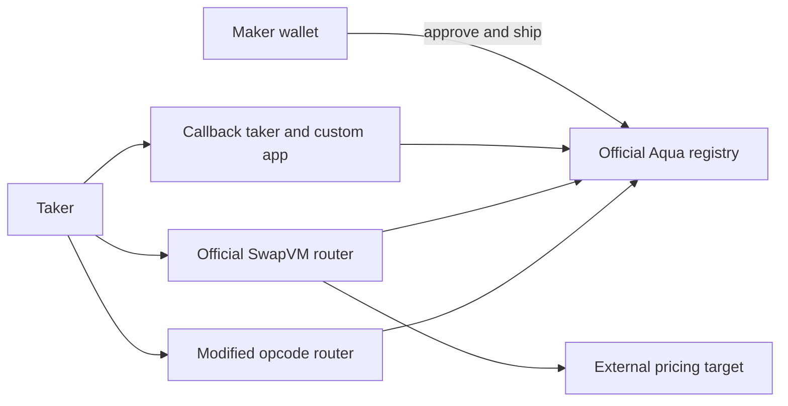

# Aqua / SwapVM starter

**Proven on Polygon and Base forks, 2026-09-14 JST.** Three runnable sub-track examples
settle real DAI/WETH transfers through the official Aqua registry. Original
starter code is MIT; dependencies retain their upstream licenses.

| Use case / track | Example |
| --- | --- |
| Open Aqua app, Path A | [app-open](app-open/): custom pricing and authenticated callback |
| SwapVM instruction extensions, Path C | [swapvm-opcode](swapvm-opcode/): custom opcode + official-router Extruction |
| Add settlement / Continuity, Path B | [continuity-recipe](continuity-recipe/): SDK pegged strategy |

Opcode extensions are part of the published open/Continuity awards, not a
separately confirmed third prize. [Tokyo card](https://ethglobal.com/events/tokyo2026/prizes/1inch).

## Five-minute quickstart

Requires Bun, Python 3.12+, and Foundry (`forge`/`anvil`). Validated versions:
Bun 1.3.14, Foundry 1.5.1, solc 0.8.30.

```sh
cd aqua
make install
make test
make demo                     # all paths, one temporary Polygon fork
cd app-open && make demo      # or one component
```

No key or paid RPC is required. The runner creates ephemeral wallets and
synthetic balances of real ERC20s on its own loopback-only fork, verifies the
upstream block and official contracts, and stops Anvil afterward. Copy
`.env.example` to `.env` to replace public RPCs. `FORK_CHAIN=base make demo`
selects Base; `FORK_BLOCK_NUMBER=93756903 make demo` replays the Polygon source block.

All build/test commands share one host lock, check uptime before each compiler
or test child, wait when one-minute load exceeds 25, and run under `nice -n 19`.
That wait can exceed five minutes on a busy machine.



## Last proven

2026-09-14 JST (2026-09-13 22:59–23:00 UTC), Polygon block **93756903**. These are
local-fork hashes, not public-chain transactions or explorer links.

| Path | First fill transaction | Full evidence |
| --- | --- | --- |
| Callback app | `0xf3fb2e5524c92f82a48d770733a260e05f1f23bd8047a3e0ac627a93c21e32d2` | [receipt](app-open/receipts/polygon-latest.json) |
| Official-router Extruction | `0xcde9344dd6ee1c11fe289027cec9fe3daf0871a56a572d8c70194e324ae31544` | [receipt](swapvm-opcode/official-extruction/receipts/polygon-latest.json) |
| Modified-router opcode | `0xfe170ccba582f5c86f88821f09b9ed93a264e68eff5a85bc8cea2395adb0f2aa` | [receipt](swapvm-opcode/receipts/polygon-latest.json) |
| SDK pegged strategy | `0x3c0ef651fdb88f10794d508c4f063b21024f6fa205b1458cf983d34f8dc74609` | [receipt](continuity-recipe/receipts/polygon-latest.json) |

`make test`: **35 Solidity unit + 24 official-contract fork + 5 SDK tests**;
strict TypeScript checks pass. Fuzz tests run 1,000 cases. Assertions cover
custody, quote/swap equality in both directions, docking, callback auth,
nonpayment, reentrancy, slippage, exact-output rounding and opcode compatibility.

Base alternate also passed every demo path on block **51275546**
(2026-09-14 JST): [app](app-open/receipts/base-latest.json),
[official Extruction](swapvm-opcode/official-extruction/receipts/base-latest.json),
[custom opcode](swapvm-opcode/receipts/base-latest.json),
[pegged strategy](continuity-recipe/receipts/base-latest.json).

## Gotchas and limits

- The upstream starter deploys a fresh registry. This kit verifies the required
  official registry/router code and router `AQUA()` before execution.
- SDK 0.4.4 has 34 Aqua opcodes; its monorepo's older contract fixture has only
  33. This kit pins official SwapVM **v1.0.2**, adding custom opcode **34** and
  preserving every upstream index. [Source evidence](SOURCES.md).
- Maker approval targets Aqua; SDK taker approval targets its router. The
  callback-app payer instead approves the callback taker. Approvals are bounded.
- Ship/dock change virtual allocations. Depleted wallet funds or revoked
  approval can make a prior quote unfillable.
- The DAI/WETH peg is synthetic fixture pricing, not a market rate. Rebasing
  and fee-on-transfer tokens are unsupported. This is an unaudited starter.
- Funding mutations are disclosed in each receipt and affect only the local
  fork. The runner never substitutes protocol bytecode or writes upstream.

## Blockers

Public, MIT-licensed starter kit published 2026-09-14 JST; used as a disclosed library per ETHGlobal Tokyo rules (info/details: starter kits allowed with transparency). The license covers original starter code; dependency terms remain in force. See [publication evidence](PRIOR-ART.md).

None for the implemented Aqua paths. Both fork demos pass. Publication and
verified reuse-disclosure wording are recorded in PRIOR-ART.md.

## Official sources

- https://github.com/1inch/aqua
- https://github.com/1inch/swap-vm
- https://github.com/1inch/sdks

[Addresses](addresses.json) · [Prior art](PRIOR-ART.md) ·
[Dependency licenses](THIRD-PARTY-NOTICES.md)

Do not use a starter's newly deployed Aqua registry as evidence of integration
with Tokyo's required official contracts. The demo must use the registry at
`0x1111113ccf1426a8e30e2bff5e005d929bf6a90a` and router at
`0x111111338c5091e8440b67b168bae16a668ac0de`.
