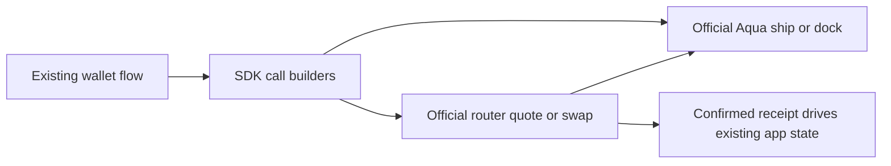

# Add Aqua settlement to an existing app

Use this when an existing app already knows its maker, pair and desired
liquidity, and needs wallet-held settlement. The runnable example builds a
generic pegged strategy with the current SDK, ships to the official router,
fills both directions and docks. It contains no prebuilt hackathon product.

## Five-minute quickstart

Requires Bun, Python 3.12+, Foundry.

```sh
cd ..
make install
cd continuity-recipe
make test
make demo
```

`FORK_CHAIN=base make demo` selects the alternate chain. The demo's DAI/WETH
peg is deliberately synthetic fixture pricing, not a price recommendation.
Use a suitable pair/rate and decimal inputs in an actual integration.

## Integration recipe (about one hour with an existing wallet flow)

1. Import `buildPeggedOrder`, `encodeShip`, `encodeQuote`, `encodeSwap` and
   `encodeDock` from `../scripts/strategies.ts`.
2. Pass your maker address and two `{ address, decimals, reserve }` objects.
   Approve the official Aqua registry for the intended maker liquidity budget.
3. Submit the maker's `encodeShip` call. Save `order.encode()` and
   `order.hash()` in your app's existing persistence; no token deposit occurs.
4. Read `encodeQuote` from the taker's address. Display expected amounts and
   approve the router for the selected input. Submit `encodeSwap` with a
   positive threshold and deadline suitable for your app.
5. Confirm the transaction receipt before updating app state. Let the maker
   call `encodeDock` to retire the strategy.

The sample's complete receipt records both custody and quote/swap assertions.
An app should refresh a quote after a state change and handle depleted maker
funds, revoked approval, expiry and docking as normal errors.



## Last proven

Proven 2026-09-14 JST on Polygon fork block **93755673**. First fill:
`0xbfa186f289056342bdb9aec23a4672b9d4b95c0ea95f160d8009378d35d62390`. [Full local-fork receipt](receipts/polygon-latest.json).

Shared tests are green: 35 unit + 24 fork + 5 SDK tests, with strict TypeScript checks.

## Disclosure and scope

Continuity is a project eligibility mode, not a synonym for copied plumbing.
Disclose this public starter and identify the work performed during the event.
The SDK pegged AMM is also the brief's Path B example. Its address ordering and
decimal normalization are handled by the SDK; keep allocations associated
with their original tokens when sorting.

[Official SDKs](https://github.com/1inch/sdks) ·
[Prior art](../PRIOR-ART.md) · [Addresses](../addresses.json)

Base alternate proven on block **51274715**, first fill:
`0x58bb276bda366d0254f38db2e33059f90ddffa2104fdef7663424893d55dd2af`. [Base receipt](receipts/base-latest.json).
