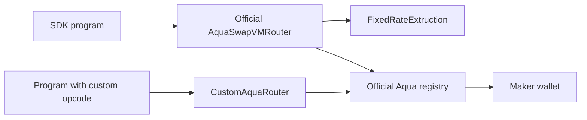

# SwapVM custom opcode and external instruction

Two generic pricing extensions support ideas that need a pricing operation
beyond the standard SDK strategies: an appended opcode in a custom router and
an `IExtruction` target called by the **official** router. Both settle through
the official Aqua registry. The custom router is labeled explicitly in every
receipt and is never presented as the official deployed router.

## Five-minute quickstart

Requires Bun, Python 3.12+, Foundry.

```sh
cd ..
make install
cd swapvm-opcode
make test
make demo
```

One command executes both examples in both token directions, then docks each
strategy. It prints transaction hashes and saves local fork evidence in
`receipts/` and `official-extruction/receipts/`. Base alternate:
`FORK_CHAIN=base make demo`.



`../src/FixedRatePricing.sol` provides deterministic arithmetic shared by the
extension forms. Arguments are ABI encoded `(token0, token1, numerator,
denominator)` in atomic units. Exact input rounds output down; exact output
rounds input up. A configured rate is an example, not a market oracle.

The official router cannot be patched. The modified router is an additional
app connected to official Aqua; the separate external-instruction demo proves
execution through the official router required by the original brief. Confirm
the current sponsor criteria for the chosen variant.

## Last proven

Proven 2026-09-14 JST on Polygon fork block **93755673**. First fill:
`0xbf1316ea8c10f64e8ca6ae3dae36d40795721d5ffd89b9035f527969f7e4f512`. [Full local-fork receipt](receipts/polygon-latest.json).

Shared tests are green: 35 unit + 24 fork + 5 SDK tests, with strict TypeScript checks.

Official-router external-instruction fill:
`0x321851b69366118a77f1648985be1ebb11d16daffecf50642a64d07efbfd974d`. [Official-router receipt](official-extruction/receipts/polygon-latest.json).

## Gotchas

- An instruction has a one-byte argument length. `IExtruction` reserves 20 bytes
  for its target, leaving at most 235 bytes for custom arguments.
- Never change instruction indexes without updating the encoder and tests.
  See `../solidity-dependencies.json` for the SDK-compatible contract revision.
- A default upstream starter deploys a fresh Aqua registry. This kit instead
  checks official registry/router code and router `AQUA()` on the fork.
- Program arguments are chosen by the maker and committed in the shipped hash.

[Official SwapVM](https://github.com/1inch/swap-vm) ·
[Prior art](../PRIOR-ART.md) · [Addresses](../addresses.json)

Base alternate proven on block **51274715**, first fill:
`0x49ccc304e581818217eaf0574eef751c41d1c1410c7d2bd02dc51a8ec1b87e46`. [Base receipt](receipts/base-latest.json).
