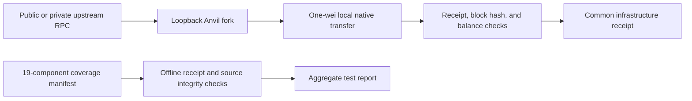

# Shared kit plumbing

Common scripts run the sponsor checks in order, validate saved receipt structure and source hashes, and exercise local Polygon, Base, and Sepolia fork infrastructure. They also document credential handling and prior-art disclosure. Original code is [MIT licensed](LICENSE).

The coverage manifest currently records **15 of 19 components proven** and **4 NOT PROVEN**. Those four are the World components, which require Developer Portal access through World App, a public `WorldPing` deployment, an authentic human proof, and a registered agent. A passing shared check does not supply those prerequisites or change their status. See [coverage.json](coverage.json) and [CREDENTIALS.md](CREDENTIALS.md).

## Quickstart

Use Bun, Python 3.10+ (tested with 3.12), Git, and Foundry (`forge`, `anvil`) for the full repository. World additionally uses Node 24's SQLite runtime. Sui's supplied compiler bootstrap targets macOS arm64 and verifies a pinned official archive. Each kit's README lists its exact toolchain requirements.

From the repository root:

```sh
make install-all
make check-all
make demo-common
```

After dependencies are installed, `make check-all` is the single validation entry point. `make demo-common` runs the three small fork canaries; it does not execute every sponsor demo. Run a selected sponsor component through that component's own Make target when you need new integration receipts.

From `common/`, the equivalent scoped commands are:

```sh
make test
make demo
make check-all
```

`make test` runs common Python unit tests and offline receipt validation. `make demo` produces infrastructure receipts on three independent local forks. The scripts use Python's standard library; there is no separate common SDK install.

## Sequential checks

[`check-all.py`](check-all.py) runs these commands one after another:

```text
make -C aqua test
make -C uniswap test
make -C world test
make -C ens test
make -C sui test
make -C curvegrid test
make -C common test
```

The orchestrator continues through all kits and reports an overall failure if any exits nonzero. Each kit owns the shared machine lock and `nice -n 19` wrapper, checks `uptime`, and waits when load exceeds 25. The outer runner does not take a second lock around those commands. Do not run compiler jobs in parallel to bypass that scheduling.

Private check logs go to `common/.run/check-all/`. The public aggregate report is `common/receipts/check-all-latest.json`, recording command exit codes, durations, log hashes, source hashes, and the source commit. It reports test/integrity status, not completion of credentialed demos.

## Fork canary scope

[`demo.py`](demo.py) starts one fork at a time through [`fork.py`](fork.py), in Polygon → Base → Sepolia order. It uses Anvil development accounts and submits a **one-wei native transfer** only to a loopback fork RPC. It checks the selected chain ID, successful transaction receipt, sender and recipient, 21,000 gas used, receipt block hash, and the recipient's exact one-wei increase.



The outputs are:

| Network | Receipt path |
| --- | --- |
| Polygon, chain 137 | `common/receipts/polygon-fork-latest.json` |
| Base, chain 8453 | `common/receipts/base-fork-latest.json` |
| Sepolia, chain 11155111 | `common/receipts/sepolia-fork-latest.json` |

Each records the upstream block number/hash, local transaction and receipt, balance assertions, source hashes, and the use of Anvil development balances. The launcher is infrastructure only: it neither installs a sponsor contract nor signs on the upstream chain. Local-fork hashes do not appear in public block explorers. Use the relevant sponsor demo for contract-specific behavior and official deployment evidence.

To retain a fork for a local client, run from the repository root:

```sh
python3 common/fork.py base --port 8545
```

The first JSON line reports `rpc_url`, `chain_id`, `source_block`, and `source_hash`, without the upstream URL. Supported chain names/IDs are `polygon`/`137`, `base`/`8453`, and `sepolia`/`11155111`. Omit `--port` to select an unused local port, set `--block NUMBER` for a recorded source block, or set `--duration SECONDS` for a bounded run. Otherwise it runs until Ctrl-C and then stops its own Anvil process.

The launcher checks both upstream and local chain IDs and the exact fork-source block hash, binds Anvil only to `127.0.0.1`, and starts it under `nice -n 19` after the load check. A retained node does not hold the compiler lock, so clients can build against it. It does not write a mnemonic or persistent chain snapshot.

## Reading evidence correctly

| Evidence kind | Meaning |
| --- | --- |
| Unit fixture | Tests local behavior under controlled inputs; mocked identity, SDK responses, test coins, and clocks remain fixtures |
| Offline receipt integrity | Checks saved JSON structure, declared scope, and source-file consistency; does not independently establish execution or canonical chain state |
| Common fork canary | Confirms local fork/RPC/transaction/balance plumbing |
| Sponsor fork receipt | Records an executed integration against the specified official contracts and fork state; replay it locally rather than looking up its transaction on a public explorer |
| Public-testnet receipt | Records actual public-chain execution, such as the Sui USDC and escrow demos |
| `NOT_PROVEN` preflight | Records a missing prerequisite or failed path; it is not a successful receipt |

The [receipt validator](validate_receipts.py) follows [coverage.json](coverage.json), which keeps proven components, missing prerequisites, and partial World/Curvegrid evidence separate. Offline JSON validation is not cryptographic verification of execution, signatures, canonical chain state, or sponsor eligibility. Re-running it does not create new integration evidence.

Keep receipt claims no broader than their assertions. A generated API transaction, authentic-looking webhook fixture, official contract address, or passing contract test is insufficient to prove a complete sponsored integration. Update the component README only after its required executed path succeeds.

## Environment and private state

Copy [`.env.example`](.env.example) to `common/.env` for common fork configuration. The launcher reads only known RPC variables through a small parser, without shell evaluation, and does not overwrite already exported variables. `POLYGON_RPC_URL` and `BASE_RPC_URL` select their respective upstreams; `SEPOLIA_RPC_URL` takes precedence over the compatible `ENS_RPC_URL` fallback. URLs must be HTTPS, or loopback HTTP for a local upstream, without userinfo or fragments. Public defaults need no API key.

Sponsor configuration remains in each kit's own ignored `.env`. [CREDENTIALS.md](CREDENTIALS.md) lists exact names, signup links, and human/funding prerequisites. Do not consolidate production keys into a repository-wide file. Common replay uses the launcher's `--block` flag; each sponsor's optional `FORK_BLOCK_NUMBER` remains its own runner setting.

`.env`, `.run/`, generated account state, private proofs, and SQLite files are ignored. Preserve generated testnet account files across faucet retries. Public receipt files contain nonsecret chain evidence and source metadata; API keys, signing keys, reusable authorization headers, and webhook secrets stay private.

## Last proven

**2026-09-14, 10:02 JST / 01:02 UTC:** all three fork canaries passed. Each transaction transferred exactly one wei on its local Anvil fork, with a successful receipt and verified recipient balance delta. The recipient is a fresh public address because well-known development addresses can already have code on an upstream chain.

| Fork | Upstream block | Local transaction receipt |
| --- | --- | --- |
| Polygon | 93761803 | [0x866a35c7e6c6bac354b77b156b3f47499fedf7a5bc0a6fd6700c942d3f84f8bc](receipts/polygon-fork-latest.json) |
| Base | 51279197 | [0xc17e5b7d905426b0ebc69ee00485735b2107380a8f21239b4c419020ddc52a2d](receipts/base-fork-latest.json) |
| Sepolia | 11699568 | [0xc2e503dc88f79e264a8c201d8c62851538831aba3aa5499617183bbd9ae8d44e](receipts/sepolia-fork-latest.json) |

The final **`make check-all` passed all 341 tests** across seven kits at `2026-09-14T01:03:35.308195+00:00`: Aqua 64, Uniswap 57, World 59, ENS 18, Sui 49, Curvegrid 60, and common 34. [Aggregate receipt](receipts/check-all-latest.json) records all seven zero exit codes, private-log hashes, and source revision `eab3af2622c556914c2c4ab20ec5e697a196a5a1`. The common suite includes real subprocess cancellation tests. Offline validation matched all recorded sponsor receipts to their source manifests.

### Public-clone reproduction

A fresh temporary clone of public revision [`b56b842`](https://github.com/ss251/tokyo-kits/tree/b56b842efc4c98ce99ebcfba63cbb277aeb001bb) passed `make install-all` followed by `make check-all` on **2026-09-14**, finishing at `2026-09-14T01:13:17.178408+00:00`. All **341 tests** and receipt/source checks passed. Installation left tracked files unchanged; testing changed only its generated aggregate report. No private state or repository dependencies/build outputs were copied. Existing host download caches were allowed; this proves a clean repository checkout on this host, not a brand-new operating-system image.

[Reproduction receipt](receipts/public-clone-latest.json) records the public revision, tool versions, installation/check commands, log hashes, and seven test results. The temporary clone was removed after success. To repeat from a directory outside your working checkout:

```sh
git clone https://github.com/ss251/tokyo-kits.git tokyo-kits-repro
cd tokyo-kits-repro
git checkout --detach b56b842efc4c98ce99ebcfba63cbb277aeb001bb
make install-all
make check-all
```

The sponsor coverage count is separate: Aqua has three proven components, Uniswap six, ENS two, Sui two, and Curvegrid two. The four World components remain **NOT PROVEN**. See the [top-level table](../README.md) for the current state and linked receipts.

Public, MIT-licensed starter kit published 2026-09-14 JST; used as a disclosed library per ETHGlobal Tokyo rules (info/details: starter kits allowed with transparency). The first complete common revision is `dc49e728ec8eb35b33b61002605874fcba88218d`, pushed **2026-09-14 10:05:04 JST** (`2026-09-14T01:05:04Z`). [PRIOR-ART.md](PRIOR-ART.md) records the public source and execution evidence separately. [AI-USAGE.md](AI-USAGE.md) records the user brief and material build decisions. Event teams must disclose the exact public commit reused and retain their own specification, prompt, and planning artifacts alongside the canonical [KITS-BRIEF.md](../KITS-BRIEF.md).
