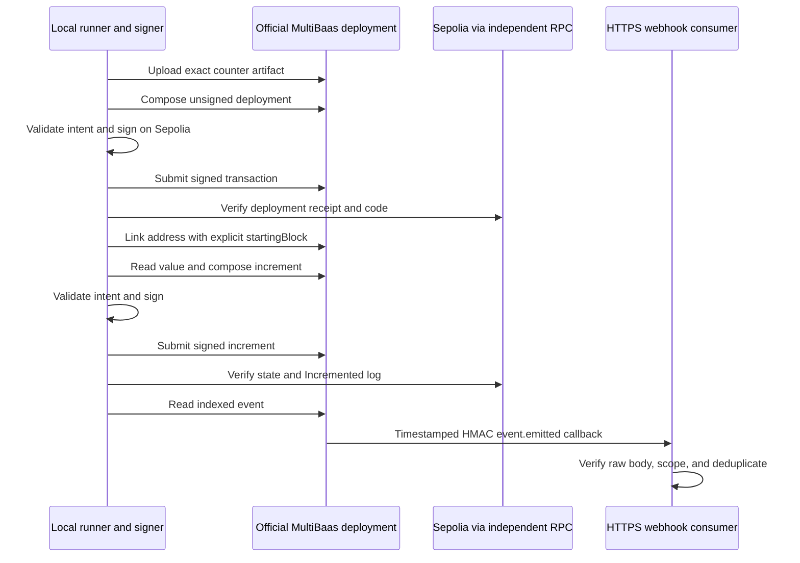

# Curvegrid MultiBaas starter

Generic MIT templates for MultiBaas contract deployment, REST read/write calls, event indexing, and authenticated webhooks. The Solidity target is an owner-only counter with no product logic. The integration uses Curvegrid's official SDK and an actual MultiBaas deployment.

**MultiBaas status: PROVEN on public Ethereum Sepolia, 2026-09-17 JST.** Both components ran against a hosted free-plan MultiBaas deployment with separate administrator and DApp User keys and an externally reachable HTTPS webhook; see [Last proven](#last-proven). A local counter test or fork transaction still demonstrates only the counter.

| Component | Example use | Command from this directory |
| --- | --- | --- |
| [multibaas-basics/](multibaas-basics/README.md) | Add a managed contract API to a generic backend | `make -C multibaas-basics demo` |
| [events-webhooks/](events-webhooks/README.md) | Consume indexed contract events in an off-chain service | `make -C events-webhooks demo` |

These are two runnable components for Curvegrid coverage. Separate Tokyo prize categories are not asserted while the sponsor's final track details remain unconfirmed.

## Setup and quickstart

Prerequisites: Bun, Python 3, Git, and Foundry (`forge`; `anvil` for the separate fork check). The project pins Solidity **0.8.30**, `@curvegrid/multibaas-sdk` **1.1.1**, and `viem` **2.56.5**.

1. Create an account at the [official Curvegrid Console](https://console.curvegrid.com/), then create a MultiBaas deployment on **Ethereum Sepolia**. The [first-steps guide](https://docs.curvegrid.com/multibaas/getting-started/account-and-deployment/) describes the free plan and signup without payment information. Each deployment has one fixed network and its own URL and permissions.
2. In the deployment UI, open **Admin → API Keys** or **My API Keys**. Create a private setup key with permissions to upload/deploy/link contracts and configure webhooks. Create a separate runtime key in a group with **Blockchain API** access; the documented **DApp User** group is the runtime starting point. Review the actual group roles for your deployment. See [API keys](https://docs.curvegrid.com/multibaas/api-keys/) and [roles](https://docs.curvegrid.com/multibaas/users-rbac/).
3. Set the variables below in a private `.env`. Use the deployment origin, such as `https://your-deployment.multibaas.com`, without `/api/v0`. A Curvegrid Testnet public Web3 key is not a replacement for these Sepolia deployment API credentials.

```sh
cp .env.example .env
make install
make test
make -C multibaas-basics demo
```

Once dependencies, credentials, and Sepolia gas are ready, those are the commands needed to start the basics demo. Account provisioning, faucet funding, indexing, and external delivery can take longer than five minutes.

`CURVEGRID_PRIVATE_KEY` optionally supplies a Sepolia-only signer. If absent, the runner generates and retains a private signer under ignored `.run/`. Fund the public address printed by the runner with testnet ETH and retry using the same account state. API credentials do not pay Ethereum gas or replace the local signer.

`make demo` runs the full integration. Missing required credentials cause a clear **NOT PROVEN** preflight result. `make build` compiles without contacting MultiBaas. Build/test/demo targets acquire the shared host lock, check `uptime`, wait above load 25, and run under `nice -n 19`.

For events, prepare HTTPS forwarding from `MULTIBAAS_WEBHOOK_URL` to local `127.0.0.1:8787/webhook`, then run `make -C events-webhooks demo`. The demo creates an ephemeral webhook, writes its private config, starts the local consumer, and only then triggers the increment. It stops the consumer after verified delivery or a bounded 120-second timeout and deletes the demo webhook during cleanup, preventing orphaned delivery retries. Do not start a second listener on that port during the demo.

`make fork-demo` runs a separate counter-only fork check without MultiBaas credentials. Its result is explicitly partial contract evidence, not sponsor end-to-end proof. Direct script selection supports `all`, `multibaas-basics`, and `events-webhooks` (`basics` and `events` are aliases); the Make targets apply the serialization wrapper.

## Configuration

| Variable | Meaning |
| --- | --- |
| `MULTIBAAS_URL` | Required HTTPS deployment origin on Sepolia; no credentials, query, fragment, or API path |
| `MULTIBAAS_ADMIN_API_KEY` | Required private setup credential for contract and webhook administration |
| `MULTIBAAS_API_KEY` | Required runtime Blockchain API credential |
| `CURVEGRID_RPC_URL` | Independent Sepolia RPC; defaults to the public endpoint in `addresses.json` |
| `CURVEGRID_PRIVATE_KEY` | Optional local testnet signer; otherwise generated in ignored `.run/` |
| `CHAIN_ID` | Optional; must be `11155111` if set |
| `MULTIBAAS_WEBHOOK_URL` | Events path: public HTTPS endpoint ending exactly in `/webhook`, without query parameters |
| `MULTIBAAS_WEBHOOK_CONFIG` | Standalone receiver's private config path; default `.run/webhook-config.json` |

Keep `.env`, private signer files, webhook secrets, and SQLite state outside git. Do not expose the setup key in a frontend or preserve raw SDK request/error objects: HTTP client configuration can contain bearer credentials. The adapter emits sanitized operation/status errors instead.

## Contract and transaction flow



[`KitCounter`](src/KitCounter.sol) sets `owner = msg.sender` at deployment. `value()` starts at zero. Only that owner can call `increment()`, which adds one and emits `Incremented(address indexed caller, uint256 value)`. Unauthorized callers revert with `Unauthorized(address)`. Overflow reverts without changing state or emitting a successful event.

The [SDK adapter](multibaas-basics/client.ts) uploads the locally compiled ABI and creation bytecode, obtains an unsigned deployment, submits the locally signed result through MultiBaas, and links the deployed address. Contract version and address alias checks reject attempts to overwrite unrelated resources. Reads use `formatInts: 'as_strings'`; the validator treats the counter value as a bounded `uint256`, not a JavaScript floating-point number.

The [local transaction validator](multibaas-basics/validation.ts) allows only the expected zero-value deployment bytecode or exact counter increment calldata. It checks sender, destination, nonce, transaction type, gas, and fees. Current ceilings are **2,000,000 gas**, **50 gwei** per gas, and **0.02 testnet ETH** maximum gas cost; callers may lower them. MultiBaas constructs transaction data, while the local signer independently decides whether that data matches the authorized operation.

Current SDK methods have no leading chain argument, despite older examples. The deployment selects the network. Its unsigned transaction schema has no `chainId`; the runner verifies MultiBaas chain status and independent RPC chain ID, then explicitly signs with local chain ID **11155111**. Extra remote fields are rejected instead of being copied into the signed transaction.

## Indexing and webhook consumer

Linking uses `startingBlock` as the deployment receipt's decimal block number. The [official SDK model](https://github.com/curvegrid/multibaas-sdk-typescript/blob/65f28a15e76f6e16feee7059301cb4fcf6b842d3/docs/LinkAddressContractRequest.md) states that omitting this field disables event indexing. The demo waits for indexing and reconciles the indexed counter event with the actual chain receipt.

The receiver listens on `127.0.0.1:8787` by default, with `POST /webhook` and metadata-only `GET /health`. Forward a public HTTPS endpoint to `/webhook` without parsing or rewriting the request body. MultiBaas must be able to reach that endpoint from outside this machine. The demo manages its own listener. For an ongoing integration outside the demo, the optional standalone receiver command is:

```sh
bun events-webhooks/server.ts
```

It reads `.run/webhook-config.json` by default, or `MULTIBAAS_WEBHOOK_CONFIG`. The private file binds the receiver to `{ chainId, contractAddress, eventSignature, secret, deploymentId, webhookId }`, with chain `11155111` and event `Incremented(address,uint256)`. `deploymentId` is the verified deployment URL hostname used as a local scope, not a claimed API UUID. The webhook creation response supplies the generated secret; it is saved privately and never printed or included in public proof JSON.

The demo retains its private config as a record, but deletes the associated ephemeral webhook. For ongoing standalone use, register your own active MultiBaas webhook and configure its actual webhook ID and secret; starting the server with a completed demo's retained config does not reactivate delivery.

For an independently configured receiver, supply all of `CHAIN_ID`, `CONTRACT_ADDRESS`, `MULTIBAAS_WEBHOOK_SECRET`, `MULTIBAAS_DEPLOYMENT_ID`, and `MULTIBAAS_WEBHOOK_ID` instead of the file. `WEBHOOK_HOST` and `WEBHOOK_PORT` can override the local listener. The durable store is `.run/webhooks.sqlite`.

The [official webhook format](https://docs.curvegrid.com/multibaas/webhooks/) signs the raw HTTP body followed immediately by the ASCII timestamp using HMAC-SHA256. The receiver verifies `X-MultiBaas-Signature` in constant time, enforces a five-minute timestamp tolerance, then validates a JSON-array batch with a 256 KiB body limit and at most 50 envelopes. It processes only the configured counter event and contract; valid authenticated unrelated events are acknowledged and ignored to avoid pointless retries.

SQLite transactions deduplicate both delivery IDs and blockchain logs within the configured deployment/webhook/chain/contract/event scope. Authenticated duplicates are acknowledged; conflicting replays return `409`. These policies protect the local consumer. The wire payload does not supply a chain ID: configuration binds the verified deployment, and the full demo reconciles accepted callback data against the independent chain receipt.

## Evidence and blockers

| Evidence | What it can establish | Current status |
| --- | --- | --- |
| Counter unit tests | Solidity owner checks, state, event, and boundary behavior | **PASS — 7 Solidity tests** |
| Separate counter fork receipt | The generic contract executes on forked chain state | **PASS — 7 Solidity tests and a partial Sepolia fork receipt**; partial evidence only |
| SDK adapter and webhook unit fixtures | Request/response validation and consumer policy under local fixtures | **PASS — 53 Bun tests, strict TypeScript** |
| Actual MultiBaas basics receipt | Hosted service upload/deploy/link/read/write plus matching Sepolia evidence | **PASS — [sepolia-latest.json](multibaas-basics/receipts/sepolia-latest.json), 2026-09-17** |
| Actual MultiBaas callback receipt | Indexed event and externally delivered authenticated webhook matching the chain log | **PASS — [sepolia-latest.json](events-webhooks/receipts/sepolia-latest.json), 2026-09-17** |

A simulated HTTP server, locally generated HMAC request, counter-only fork transaction, or generic RPC read cannot satisfy either MultiBaas proof row. Missing permissions, credentials, indexing support, gas, or callback reachability remain documented blockers until resolved.

## Last proven

Both service components are **PROVEN** against the hosted deployment `vqnz4g54bje7lou6yfz37hjqa4.multibaas.com` (Ethereum Sepolia, free plan) on 2026-09-17 JST, source revision `47783eb` plus the receipt-time working tree recorded through source hashes:

- **multibaas-basics** ([receipt](multibaas-basics/receipts/sepolia-latest.json), recorded 2026-09-16T20:53:30Z): SDK-composed deployment `0xe2d18f4239ab133d28bfdc694ec7204cf719819d04626cb049c1aa3147e1fd20` (block 11719197) created counter `0xaC52F893591fe0Fb7a2Dc9285D63ae81E857bFA2` under label `tokyokits-431b51f4d093`; SDK-composed owner increment `0xb7cfd74373e04296b3774537fad3a158c007189182a2c7879b74d6b45236557c` (block 11719198) moved the value 0 → 1, read back through the REST API and reconciled with an independent Sepolia RPC.
- **events-webhooks** ([receipt](events-webhooks/receipts/sepolia-latest.json), recorded 2026-09-16T20:53:38Z): write `0x546287cd67476fa92fac343fcaae1f266be3437b30c762b94c07fbc545d10dbf` (block 11719199, log index 141) was indexed by MultiBaas and delivered by an authenticated `event.emitted` webhook (subscription 6) through a temporary `cloudflared` tunnel to the local consumer, then reconciled with the canonical receipt.

These are public-chain transactions and appear on a Sepolia explorer. Live service behaviours found and handled during proving: a DApp User key receives HTTP 403 on the event indexing status endpoint (the administrator key is used there), the events endpoint rejects `limit` above 50, its `tx_hash` filter returned no rows for an indexed event (events are listed by block and matched by hash), and the per-contract indexing status head stays at the link block while new events are already listed.

**60 tests pass** (53 Bun +7 Solidity), with strict TypeScript. [Partial fork evidence](infrastructure/receipts/sepolia-fork-latest.json), refreshed 2026-09-16T20:55:22.219Z on Sepolia fork block 11719207, contains successful deployment/increment and a mined unauthorized rejection. Increment `0xb4f90ffe23ff95cf90a3b6e49e5673d36a2eaab580057a196a6d4fb0cf73c402`. All 26 recorded source hashes match the final implementation. This receipt proves only the generic contract and local plumbing; the MultiBaas API/indexing/webhook proof is the pair of hosted-service receipts above.

See [SOURCES.md](SOURCES.md) for current official interfaces, [THIRD-PARTY.md](THIRD-PARTY.md) for licenses, and [PRIOR-ART.md](PRIOR-ART.md) for publication and event disclosure. Published publicly 2026-09-14T00:45:31Z (Sep14 09:45:31 JST), revision `e37e0644fcece6691705236f7ec573344b96be86`.


## Prior art

Public, MIT-licensed starter kit published 2026-09-14; used as a disclosed library per ETHGlobal Tokyo rules (info/details: starter kits allowed with transparency).

Public URL: https://github.com/ss251/tokyo-kits/tree/main/curvegrid ; first complete revision `e37e0644fcece6691705236f7ec573344b96be86`, pushed 2026-09-14T00:45:31Z (Sep14 09:45:31 JST). Both service components were NOT PROVEN at first publication and were proven on 2026-09-17 JST.
