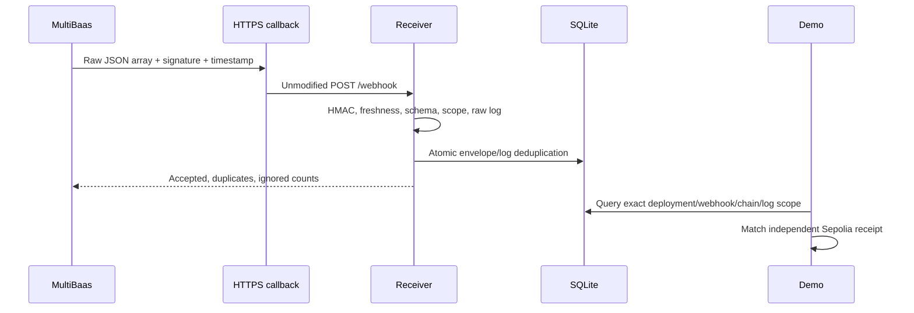

# MultiBaas indexing and authenticated webhooks

**Last proven: NOT PROVEN.** The live path needs a MultiBaas Sepolia deployment, private setup/runtime API keys, a funded testnet signer, and an externally reachable HTTPS callback. Local protocol fixtures and counter-only fork transactions do not prove MultiBaas indexing or delivery. Public publication status is recorded in [PRIOR-ART.md](../PRIOR-ART.md).

Use this starter when an off-chain service must react to an indexed contract event: for example, refreshing a dashboard or queuing a receipt notification. The example consumes the generic counter's `Incremented(address,uint256)` event without adding product logic.

## Run

From the `curvegrid/` directory, complete the [account and API-key setup](../README.md), install the pinned dependencies with `make install`, and configure the variables in [.env.example](../.env.example). Forward a public HTTPS URL ending in `/webhook` to `127.0.0.1:8787/webhook` without rewriting the HTTP body.

```sh
make -C events-webhooks test
make -C events-webhooks demo
```

The demo deploys and links the counter with an indexing start block, creates a MultiBaas `event.emitted` subscription, starts the local receiver, and sends a signed Sepolia transaction through the SDK. It waits for the SDK-indexed event and an actual authenticated callback, then reconciles both against the independent RPC receipt. A successful run writes `events-webhooks/receipts/sepolia-latest.json`. Missing prerequisites or a callback timeout remain **NOT PROVEN**; a locally generated HMAC fixture cannot satisfy this demo.

The demo manages port 8787 and its webhook subscription. Do not start the standalone listener simultaneously. For a separately configured, ongoing subscription:

```sh
make -C events-webhooks serve
```

This reads private `.run/webhook-config.json`, or the path in `MULTIBAAS_WEBHOOK_CONFIG`, relative to the kit directory. The file must have no group/other permissions (`chmod 600`) and contain `{ chainId, contractAddress, eventSignature, secret, deploymentId, webhookId }`. Use Sepolia `11155111`, the actual linked counter address, `Incremented(address,uint256)`, the API-generated webhook secret and ID, and the independently verified deployment URL's hostname as `deploymentId`. This hostname is a local scope key, not a claimed MultiBaas API deployment UUID.

If the default file does not exist, the receiver accepts `CHAIN_ID`, `CONTRACT_ADDRESS`, `MULTIBAAS_WEBHOOK_SECRET`, `MULTIBAAS_DEPLOYMENT_ID`, and `MULTIBAAS_WEBHOOK_ID`. `WEBHOOK_HOST` and `WEBHOOK_PORT` override the default listener. Keep configuration, API credentials, signer material, and `.run/webhooks.sqlite` outside git. The demo deletes its temporary subscription on exit; its saved config alone does not establish an ongoing subscription.

## Verification and storage



The [official webhook protocol](https://docs.curvegrid.com/multibaas/webhooks/) authenticates `rawBodyBytes || decimalTimestampASCII` using HMAC-SHA256 with the UTF-8 secret, without a separator. The receiver compares the 64-character hexadecimal `X-MultiBaas-Signature` in constant time and accepts `X-MultiBaas-Timestamp` only within 300 seconds of its clock, inclusive. It bounds the raw JSON body to 256 KiB and each batch to 50 envelopes.

The delivery format is `[{ id: "UUID", event: "event.emitted", data: Event }]`. It differs from the SDK's webhook-management event model, whose ID is numeric. Validation uses the pinned SDK 1.1.1 `Event` fields, including `contract.addressAlias`. Matching counter events must also contain `rawFields`; their decoded caller/value and transaction, block, contract, and log metadata must agree with that Ethereum log.

A subscription can deliver events from other indexed contracts. After authentication and bounded schema validation, valid unrelated contracts or signatures are acknowledged with an `ignored` count and never stored. Malformed payloads remain rejected. Matching events enter one SQLite transaction, scoped by deployment hostname, webhook ID, chain, contract, and event signature. Repeated envelope UUIDs or transaction/log identities are acknowledged as duplicates; conflicting content returns `409` and rolls back the entire batch.

Successful responses are `{ ok: true, accepted, duplicates, ignored }`. Invalid signatures or stale timestamps return `401`; invalid JSON/schema returns `400`; inconsistent matching logs return `422`; oversized bodies return `413`; non-JSON bodies return `415`. The store retains the authenticated event, scope, body SHA-256, timestamp, and receive time. It excludes secrets and signature headers.

The wire event has **no chain ID**. Receiver authentication proves possession of the configured webhook secret. The full demo separately verifies the deployment's chain and reconciles the event with the independent Sepolia receipt; the local store alone cannot establish chain execution or finality.

## Reuse

`verifyDelivery(rawBytes, signature, timestamp, config)` produces an immutable authenticated delivery. `WebhookStore.ingest(delivery)` persists it atomically. `WebhookStore.findEvent(query)` requires the complete scope plus transaction hash and log index; the demo uses this read helper to retrieve its callback evidence. `startWebhookServer({ config, store })` exposes the receiver. Serialized or manually constructed delivery objects cannot bypass the verifier's runtime check.

For another contract, deliberately update the event ABI, schema, scope policy, and tests together. The existing receipt reconciler and decoder are specific to the counter event. `transaction.included` is documented for Cloud Wallet transactions; this locally signed example uses `event.emitted`.

The tests use synthetic protocol fixtures, real SQLite transactions, and a local HTTP server. They cover byte-exact HMAC validation, time boundaries, scope exclusion, decoded/raw-log agreement, persistence, duplicates, conflicting replay rollback, and mixed batches. They are not sponsor end-to-end evidence. The starter is MIT licensed; see [official sources](../SOURCES.md) and [third-party notices](../THIRD-PARTY.md).


Current validation: **60 tests pass** (53 Bun +7 Solidity), strict TypeScript. The actual `events-webhooks` demo preflight on 2026-09-14 is [recorded](preflight-latest.json) and fails for missing service configuration. A [separate counter fork receipt](../infrastructure/receipts/sepolia-fork-latest.json) is **partial only**, never sponsor integration proof.

The bounded demo deletes its temporary remote webhook on exit and preserves any primary failure if cleanup also fails. The saved private config is a record of that demo endpoint. Register an active webhook and use its current ID/secret when running the standalone listener for an ongoing integration.


## Prior art

Public, MIT-licensed starter kit published 2026-09-14; used as a disclosed library per ETHGlobal Tokyo rules (info/details: starter kits allowed with transparency).

Public URL: https://github.com/ss251/tokyo-kits/tree/main/curvegrid ; first complete revision `e37e0644fcece6691705236f7ec573344b96be86`, pushed 2026-09-14T00:45:31Z (Sep14 09:45:31 JST). Both service components remain explicitly NOT PROVEN pending credentials.
