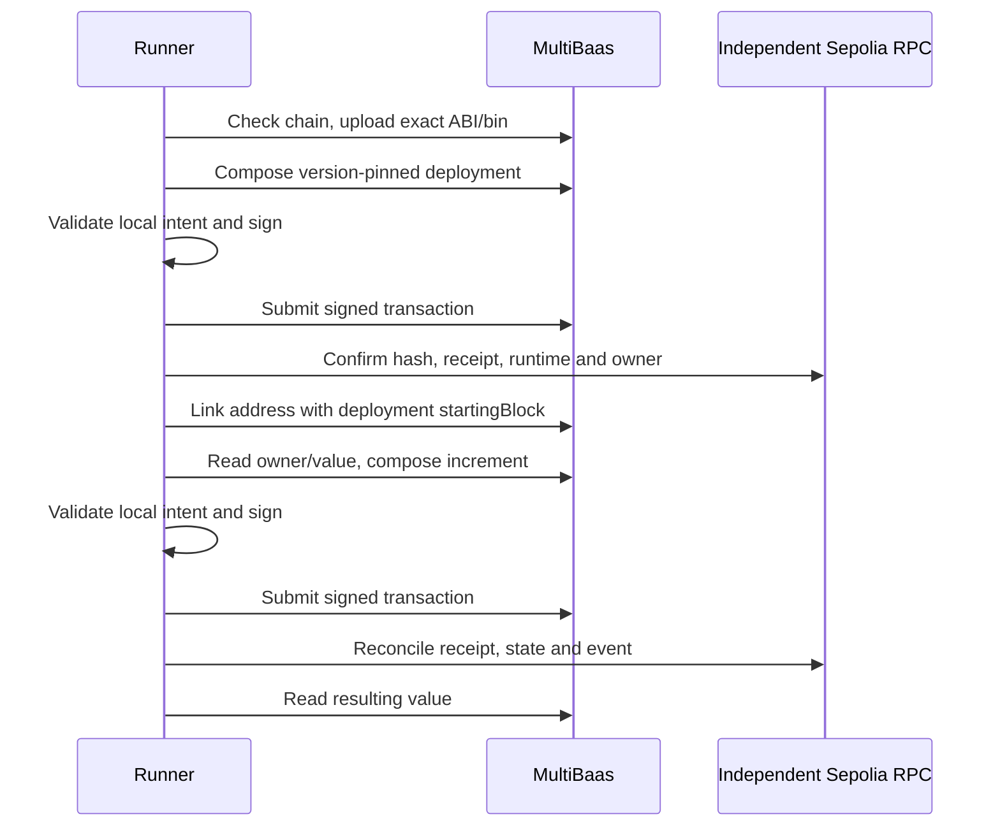

# MultiBaas deploy, link, read and write

This generic counter demonstrates the complete MultiBaas boundary: upload a local ABI and creation bytecode, request an unsigned deployment, sign locally, submit through the official SDK, reconcile the independent Sepolia RPC receipt, link the contract, and read and increment its value through MultiBaas.

Use this starter when an application needs a REST interface over a contract, decoded chain data, or indexed events. The counter supplies a small observable state change; it contains no product logic, token transfer, hosted custody or Cloud Wallet dependency. Tokyo's Curvegrid sub-track names and final criteria remain unconfirmed.

## Quickstart

From `curvegrid/`:

```sh
cp .env.example .env
make install
make -C multibaas-basics demo
make test
```

Create a **Sepolia** deployment at [Curvegrid Console](https://console.curvegrid.com/) following the [official quickstart](https://docs.curvegrid.com/multibaas/getting-started/quickstart/). In its Admin → API Keys screen create two keys: an **Administrators** key for contract upload/linking, and a **DApp User** key for reads, transaction composition and events. Set `MULTIBAAS_URL` to the HTTPS deployment origin, `MULTIBAAS_ADMIN_API_KEY` to the setup key, and `MULTIBAAS_API_KEY` to the DApp key. These CLI credentials remain server-side. No portal session or screenshot is supplied by this kit.

Set `CURVEGRID_RPC_URL` to an independent Sepolia RPC. The runner uses `CURVEGRID_PRIVATE_KEY`, or its generated account in ignored `.run/`; fund that account with testnet ETH before running the live flow. Keep `.env` and `.run/` private and out of git. Missing deployment credentials or funding must fail as **NOT PROVEN**. A local fork has its own proof command and does not satisfy this MultiBaas demo.

## Flow and boundaries



`KitCounter` starts at zero and stores the deployment sender as its immutable owner. Only that owner can call `increment()`, which emits `Incremented(address indexed caller,uint256 value)`. The demo expects the new value to be one and checks the emitter, caller, event value, transaction hash, block hash and log index against the independent receipt. Runtime verification uses only the compiler's immutable-reference ranges and separately checks `owner()`.

[`client.ts`](client.ts) uses SDK **1.1.1** from official commit [`65f28a15e76f6e16feee7059301cb4fcf6b842d3`](https://github.com/curvegrid/multibaas-sdk-typescript/tree/65f28a15e76f6e16feee7059301cb4fcf6b842d3). The adapter keeps setup and DApp credentials separate, refuses to overwrite unrelated ABI versions or address aliases, disables HTTP redirects, bounds response sizes/timeouts, and sanitizes HTTP errors so credentials cannot appear in exception output.

[`validation.ts`](validation.ts) reconstructs a signing request from a specific local intent. Both chain sources must identify Sepolia **11155111**. Sender, nonce, destination, bytecode/calldata and zero native value must match; only legacy and EIP-1559 transactions are supported. Gas is capped at 2,000,000, fee at 50 gwei, and maximum per-transaction cost at 0.02 testnet ETH. Increment calls use a tighter 200,000 gas cap. An unsigned response or submission hash alone is not successful execution.

[`demo.ts`](demo.ts) exports `runBasics(BasicsContext)`. The root runner supplies local signing, SDK submission, RPC receipt reconciliation, compiler artifact verification and receipt persistence through explicit callbacks. The adapter never receives the private key. Event polling is reusable from [`events-webhooks/poll.ts`](../events-webhooks/poll.ts); the separate events demo must prove indexing and real webhook delivery.

## SDK gotchas

- Version 1.1.1 omits the older `chain` positional argument. Calls still use REST paths under `/chains/ethereum`; that path name does not mean Ethereum mainnet.
- `deployContractVersion()` returns `{tx,submitted,deployAt?,label?}` without a `kind` field. A write call returns `kind: "TransactionToSignResponse"`; a read returns `kind: "MethodCallResponse"`.
- Unsigned transactions do not contain a chain ID. The runner validates both services and adds Sepolia locally before signing. `gasFeeCap`/`gasTipCap` map to viem's `maxFeePerGas`/`maxPriorityFeePerGas`.
- `formatInts: "as_strings"` prevents integer precision loss. The counter's read validator accepts a decimal uint256 string, not arrays, objects or JavaScript numbers.
- Omitting `startingBlock` when linking disables event indexing. This demo uses the actual deployment block, preserving events emitted after linking.
- MultiBaas historical reads are plan-dependent. This simple owner-only flow compares current SDK reads with independent RPC state; it does not pretend to prove historical API support.
- Reusing an alias or contract version with different content fails. Choose a fresh label/version rather than silently replacing another integration.

## Last proven

**NOT PROVEN — MultiBaas deployment URL and administrator/DApp credentials are absent.** No live MultiBaas deployment, indexed-event result, or webhook delivery is claimed. The checked-in tests use explicitly labeled offline fixtures. Root runner receipts, if present, distinguish a local contract fork from this credentialed integration.

Run the credentialed demo, retain its SDK and independent RPC receipt, and record the date, network, deployment address and both transaction hashes here after success. Preserve the underlying evidence file and exact source commit.

Original starter code is MIT licensed. The upstream SDK is MIT; see the root [third-party notices](../THIRD-PARTY-NOTICES.md). Publication status and disclosure are maintained in [PRIOR-ART.md](../PRIOR-ART.md).

Official references: [backend credentials and signing](https://docs.curvegrid.com/multibaas/getting-started/build-a-backend/), [contract APIs](https://github.com/curvegrid/multibaas-sdk-typescript/blob/65f28a15e76f6e16feee7059301cb4fcf6b842d3/docs/ContractsApi.md), [chain APIs](https://github.com/curvegrid/multibaas-sdk-typescript/blob/65f28a15e76f6e16feee7059301cb4fcf6b842d3/docs/ChainsApi.md), [events](https://docs.curvegrid.com/multibaas/event-indexing/).


Current validation: **60 tests pass** (53 Bun +7 Solidity), strict TypeScript. The actual `multibaas-basics` demo preflight on 2026-09-14 is [recorded](preflight-latest.json) and fails for missing service configuration. A [separate counter fork receipt](../infrastructure/receipts/sepolia-fork-latest.json) is **partial only**, never sponsor integration proof.


## Prior art

Public, MIT-licensed starter kit published 2026-09-14; used as a disclosed library per ETHGlobal Tokyo rules (info/details: starter kits allowed with transparency).

Public URL: https://github.com/ss251/tokyo-kits/tree/main/curvegrid ; first complete revision `e37e0644fcece6691705236f7ec573344b96be86`, pushed 2026-09-14T00:45:31Z (Sep14 09:45:31 JST). Both service components remain explicitly NOT PROVEN pending credentials.
