# New app with ENSv2

Use this component for **Best Use of ENSv2**: an application whose recipient and behavior come from ENS records. The generic UI reads an address plus three text values and applies them to the actual rendered application. Changing `app:enabled` disables its action; changing `app:limit` changes the accepted request size. A parent-linked subname gives the same adapter a separate configuration namespace.

This is starter code, with no project-specific product logic. An app using names as mutable configuration or delegated namespaces would use it. A displayed name alone would not demonstrate the dependency this example is designed to establish.

## Five-minute quickstart

From `ens/`, with Node, Bun, Python, and Anvil available:

```sh
cp .env.example .env
make install
make -C new-app-ensv2 demo
make test
make dev
```

The demo executes against an isolated Sepolia fork. It writes evidence to [`receipts/sepolia-latest.json`](receipts/sepolia-latest.json) only after its assertions pass. The shared serial wrapper checks machine load and serializes builds/tests; do not launch additional compiler jobs concurrently.

Open `http://localhost:3000`. Enter a publicly registered ENSv2 Sepolia name with the records below. `ENS_DEMO_NAME` can prefill the input. The UI uses the server's `ENS_RPC_URL`; no private RPC URL reaches the browser. A name created only on the demo's ephemeral fork will not resolve on public Sepolia after that fork stops. To inspect local fork state in the UI, keep the fork alive separately and point the server at that fork RPC.

## Records that drive the app

| Record | Required value | Visible effect |
| --- | --- | --- |
| ETH address record | Nonzero 20-byte Ethereum address | Selects the current recipient. |
| `app:label` | 1–80 characters | Supplies the application heading. |
| `app:enabled` | Exactly `true` or `false` | Enables or disables the action preview. |
| `app:limit` | Integer from 0 through 1000 | Bounds the requested units; zero allows no action. |

The namespace is a deliberately small starter convention, not a claimed ENS standard. Text values are rendered as text; no record is interpreted as HTML, JavaScript, an RPC endpoint, or a fetch URL. CCIP-Read is disabled for this on-chain-only adapter.

```mermaid
flowchart LR
    Input[Name or subname] --> API[Next.js resolve endpoint]
    API --> UR[Official Sepolia Universal Resolver]
    UR --> Registry[ENSv2 registry hierarchy]
    Registry --> Resolver[Name's configured resolver]
    Resolver --> Values[Address + validated text records]
    Values --> App[Recipient / label / enabled state / limit]
    App --> Preview[Explicit local action preview]
```



[`POST /api/resolve`](../app/api/resolve/route.ts) accepts `{ "input": "your-name.eth" }`. It normalizes the name, checks chain ID **11155111**, reads all records at one block, and returns configuration plus the block number/hash/time and both resolver addresses. Failed or malformed resolution returns an error; there is no fixture fallback. A literal address is accepted as an explicit baseline and returns no ENS evidence.

The browser's **Preview action** produces local JSON only. It sends no transaction and does not establish identity or contract authorization. The CLI separately demonstrates executed ENS writes and permissions; preserve that distinction when presenting evidence.

## Registration and subnames

Use the official contracts and ABI snapshot recorded in [`addresses.json`](../addresses.json). The current Universal Resolver is **`0xeEeEEEeE14D718C2B47D9923Deab1335E144EeEe`**, pinned from the official deployment repository at **`97a57293f3b4279d94b571e678edb53ce62638f4`**. Earlier preview tutorials contain different deployment addresses; the current manifest and the demo's bytecode checks take precedence.

Discover the name's resolver before writing. A newly deployed user registry must be attached through the parent's subregistry setting; an unconnected registry's tokens are not resolvable subnames. Grant only the required record or registration permissions to a delegate, then prove a permitted operation and a rejected operation in the receipt. ENSv2 current token IDs and permission scopes matter; do not infer authority from an owner label in the UI.

Test USDC used for registration is the official Sepolia test asset from the deployment manifest. Fork gas funding and test tokens are fixtures, not mainnet value or public transaction execution.

## Last proven

**PENDING first validated demo receipt and shared test run.** No successful transaction or public hosting claim is made here yet. The root build task will update this section after the demo completes. A fork transaction hash is verified against the saved fork receipt, not the public Sepolia explorer.

Public live-demo URL: **not deployed**. Tokyo's ENS card separately requires a functioning ENSv2 Sepolia integration, accessible source, and a live-demo link. A local fork receipt alone does not meet that hosted-demo requirement. Before submission, register and configure a public Sepolia name, deploy this interface, verify live reads, and record the actual URL.

At the event, confirm the ENS booth's current demonstration/check-in instructions. Past-event booth practices and the general Tokyo guides do not establish an additional mandatory ENS-specific check-in rule; follow the current sponsor and dashboard instructions.

## Sources and reuse

Exact runtime pins: viem **2.56.5**, Next **16.3.5**, React **19.3.0**. Reads use viem against the official Universal Resolver; no unpinned ENS preview SDK is required. Deployment artifact hashes and license provenance are in [`../SOURCES.md`](../SOURCES.md) and [`../addresses.json`](../addresses.json).

Official references: [ENSv2 application guide](https://docs.ens.domains/ensv2/tutorial-app-developers/), [current deployments](https://docs.ens.domains/learn/deployments/), [contract source snapshot](https://github.com/ensdomains/contracts-v2/tree/97a57293f3b4279d94b571e678edb53ce62638f4), [Tokyo ENS criteria](https://ethglobal.com/events/tokyo2026/prizes/ens).

Original starter code is MIT licensed. Public prior-art publication and its date remain pending the actual repository push. Disclose the reused commit and distinguish new event work; see [`../PRIOR-ART.md`](../PRIOR-ART.md).
