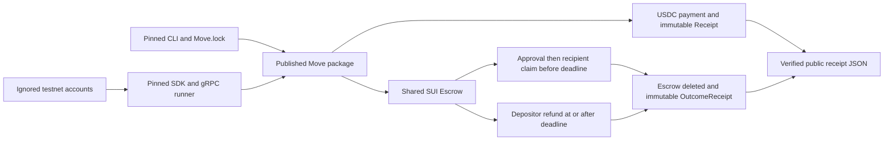

# Sui DeFi & Payments starter

MIT-licensed Move and TypeScript templates for two Sui sponsor components: an official testnet USDC payment with sponsored gas, and an approval/deadline escrow using testnet SUI. Both use the official framework and pinned `@mysten/sui` SDK. They share package publication, account handling, transaction validation, and public receipt capture.

**Both components are proven on public Sui Testnet.** Strict TypeScript, **20 Bun tests**, and **29 Move tests** pass. Receipts verify real official USDC, gas sponsorship, conditional escrow settlement, and immutable objects.

| Sponsor coverage | Component | Use it for | Run from this directory |
| --- | --- | --- | --- |
| Sui “DeFi & Payments”: payments | [payments/](payments/README.md) | Transfer official USDC with a separate gas payer and an immutable receipt | `make -C payments demo` |
| Sui “DeFi & Payments”: DeFi | [defi/](defi/README.md) | Hold a coin until depositor approval and recipient claim, with an expiry refund | `make -C defi demo` |

These are component examples under the sponsor's DeFi & Payments coverage, not a claim that each is a separately confirmed prize category. The kit has no third-party exchange dependency or product-specific business logic.

## Quickstart

Prerequisites: Bun, Python 3, Git, and macOS arm64 for the supplied compiler bootstrap. The SDK is ESM and declares Node >=22 when used outside Bun. From this directory:

```sh
cp .env.example .env
make install
```

Installation downloads the official pinned Sui CLI archive, verifies its size and SHA-256, and extracts only the executable into `.run/tooling/`. The archive is approximately 382 MB. Other operating systems need a corresponding official release asset and checksum pinned in `toolchain.json`; the bootstrap fails explicitly on unsupported hosts.

After installation, the native-SUI path needs only these commands and normally starts within five minutes when the faucet, public endpoint, and machine load permit:

```sh
make -C defi demo
make test
```

The demo creates three local testnet accounts, requests official faucet SUI, compiles and publishes the two Move modules, then executes an approved claim and an expired refund. It waits for the real on-chain Clock before refunding. It prints the package ID, transaction digests, and receipt path.

For the stablecoin component, first print the generated public addresses:

```sh
python3 scripts/serial.py bun scripts/demo.ts accounts
```

Fund the **payer** with USDC on **Sui Testnet** through the [official Circle faucet](https://faucet.circle.com), then run:

```sh
make -C payments demo
```

Keep the same `.run/accounts.json` between funding and retries. The payment requires one official testnet USDC; the runner obtains native SUI separately for publication and gas. During setup, the Circle browser faucet supplied 20 testnet USDC without a human CAPTCHA. That funding alone is not a successful payment proof.

If the SUI faucet API reports a rate limit, use the accounts command above and submit both the **payer** and **sponsor** addresses to the [official SUI browser faucet](https://faucet.sui.io), selecting Testnet. No account or wallet connection is required. The observed browser flow completed its normal proof-of-work wait and funded the payer even while the API was blocked. Retry the demo after both addresses have SUI. Faucet waits can extend setup beyond five minutes. Missing funding produces **NOT PROVEN**, never a substitute-token success.

`make demo` runs both components. If a component encounters a recognized prerequisite blocker, the runner records its preflight failure, continues to the other component, and exits nonzero. `make build` only compiles. All build/test/demo Make targets use the shared host lock, check `uptime`, wait while load exceeds 25, and run under `nice -n 19`. Use those targets for compilation and network execution.

## Architecture



[`payments::pay<T>`](move/sources/payments.move) transfers the supplied `Coin<T>` in full, records the transaction sender as payer, and freezes a typed receipt. The TS payment scenario splits exactly **1,000,000 atomic units** of the official six-decimal USDC type. Payer, recipient, and gas sponsor are distinct.

[`escrow`](move/sources/escrow.move) stores the supplied balance in a shared object. Only the depositor can approve, and only the approved recipient can claim while `Clock.timestamp_ms < deadline_ms`. At `timestamp_ms >= deadline_ms`, only the depositor can refund. Approval does not extend the deadline. Each settlement transfers the full balance, deletes the escrow, and freezes its outcome receipt. Outcome `0` is a claim; `1` is a refund.

The DeFi demo creates two **1,000,000 MIST** escrows. Settlement gas comes from a separate sponsor, so receipt payouts can be compared directly with recipient balance effects. Shared-object accessibility grants no authority: the Move module checks the transaction sender, not the gas sponsor. References are public bytes bounded to 1–128 bytes.

## Network and pins

| Item | Pinned value |
| --- | --- |
| Network | Sui Testnet; genesis `69WiPg3DAQiwdxfncX6wYQ2siKwAe6L9BZthQea3JNMD` |
| gRPC endpoint | `https://fullnode.testnet.sui.io:443` via `SUI_GRPC_URL` |
| Official framework / Clock | `0x2` / `0x6` |
| SDK | `@mysten/sui` **2.31.0** |
| CLI | Official **testnet-v1.79.0**, source `46f18562f1f5af2438d35828e8b62d5e0b972db7` |
| Move edition | **2024** |
| Resolved Sui / MoveStdlib source | `ae59d7718668b468ce65702ecb0440aa2330f389` in generated `move/Move.lock` |

The **CLI source commit and framework dependency revision differ**. The official CLI selected the latter implicitly for `--build-env testnet`; the checked-in lock records that resolution. Retain both pins. [Toolchain metadata](toolchain.json), [network/asset constants](addresses.json), [Bun lock](bun.lock), and [Move lock](move/Move.lock) are the reproduction inputs. See [SOURCES.md](SOURCES.md) for official provenance.

The stablecoin type is the [Circle-published Sui Testnet USDC type](https://developers.circle.com/stablecoins/usdc-contract-addresses):

```text
0xa1ec7fc00a6f40db9693ad1415d0c193ad3906494428cf252621037bd7117e29::usdc::USDC
```

The client checks the Testnet genesis before executing. Changing an endpoint cannot silently switch the runner to Mainnet or Devnet.

## Integration notes

- **Use gRPC.** This kit uses `SuiGrpcClient` for state, simulation, publication, execution, and receipt reads. Legacy public JSON-RPC endpoints were unavailable during setup. The [official migration guide](https://docs.sui.io/develop/accessing-data/json-rpc-migration) documents public Mainnet shutdown and the remaining retirement stages; do not paste old `SuiClient` JSON-RPC examples into this runner.
- **Keep the transaction bytes fixed before signing.** The helper selects an owned gas coin, its version/digest, gas owner, current gas price, and bounded budget before sender and sponsor sign the same bytes. This is a local sponsorship example, not a public service that accepts arbitrary transaction requests. See [official sponsorship guidance](https://docs.sui.io/develop/transaction-payment/sponsor-txn).
- **Reserve deposit plus gas budget.** Escrow creation splits the transaction's gas coin. Its declared withdrawal must fit in addition to the entire reserved gas budget. Pass the original `Transaction` through the runner so the local funding declaration remains attached.
- **A digest alone is insufficient.** The runner requires successful effects, then checks exact typed objects, decoded events, immutable ownership, balances, sender/sponsor, and escrow deletion. Negative simulations require the exact package, module, and Move abort code; transport or gas failures cannot pass them.
- **Unit clocks and coins are fixtures.** Move tests mint SUI and control time through framework testing APIs. Public demos use real testnet coins and Clock `0x6`. Native-SUI escrow evidence does not prove a USDC payment. No zkLogin, DeepBook, or Cetus integration is claimed.

## Private state and receipts

The runner generates three Ed25519 keys in ignored `.run/accounts.json` and enforces account-file mode `0600`. It prints public addresses only. It neither reads nor changes the global Sui CLI wallet or keystore. `.env` and `.run/` are ignored by the repository. Keep production keys out of this testnet starter and retain the generated accounts across faucet retries.

Successful scenarios write `payments/receipts/testnet-latest.json` or `defi/receipts/testnet-latest.json`. These contain public transaction evidence, package ID, chain identifier, decoded receipt/event data, source-file hashes, compiled-bytecode hash, SDK/toolchain metadata, and source commit/dirty status. Private account state is not copied into receipts. A `preflight-latest.json` with `NOT_PROVEN` records a blocker and is not a successful receipt.

## Last proven

| Check | Current result |
| --- | --- |
| Strict TypeScript + Bun tests | **PASS — 20 tests** |
| Pinned Move compiler and unit tests | **PASS — two modules, 29 tests** |
| Official USDC sponsored payment | **PASS — sponsored official USDC payment** |
| SUI escrow claim and refund | **PASS — approved claim and expired refund** |

Executed 2026-09-14T00:25:07.554Z on public Testnet. Package `0xfb86f2c043d066a5fe6462fbe426a0e63dfb2a2a0a0982d2d06797a8c49de865`; publication `DJzzkntZTwU3S8NbjMgvZZzCfMxJdq2RLfDMkG4aA5Wy`. [Payment receipt](payments/receipts/testnet-latest.json): `D1rt8HzpFAfEjkABg5NUZJJkWKcGqihkZ9beuy55YXJY`. [Escrow receipt](defi/receipts/testnet-latest.json): claim `4moZ8Bkt8a44Z1Ej3xg1isj4aLbXq2Wrk3tqpsXYmV23`, refund `AJXnY4nZKrtE67en3bsbk6dyXXby1SEsmge8du49VAJw`. Six executed escrow transactions and seven checked Move-abort simulations pass. Both source manifests contain 19 SHA-256 entries matching this implementation. [PRIOR-ART.md](PRIOR-ART.md) describes the disclosure boundary. Original kit code is [MIT](LICENSE); upstream licenses are recorded in [THIRD-PARTY.md](THIRD-PARTY.md).


## Prior art

Public, MIT-licensed starter kit published 2026-09-14; used as a disclosed library per ETHGlobal Tokyo rules (info/details: starter kits allowed with transparency).

Public repository: https://github.com/ss251/tokyo-kits/tree/main/sui ; first complete public revision `34d34b4d8255673b282cb3659b91b2631bc70d31`, pushed 2026-09-14T00:26:25Z (Sep 14 09:26:25 JST). See [PRIOR-ART.md](PRIOR-ART.md).
