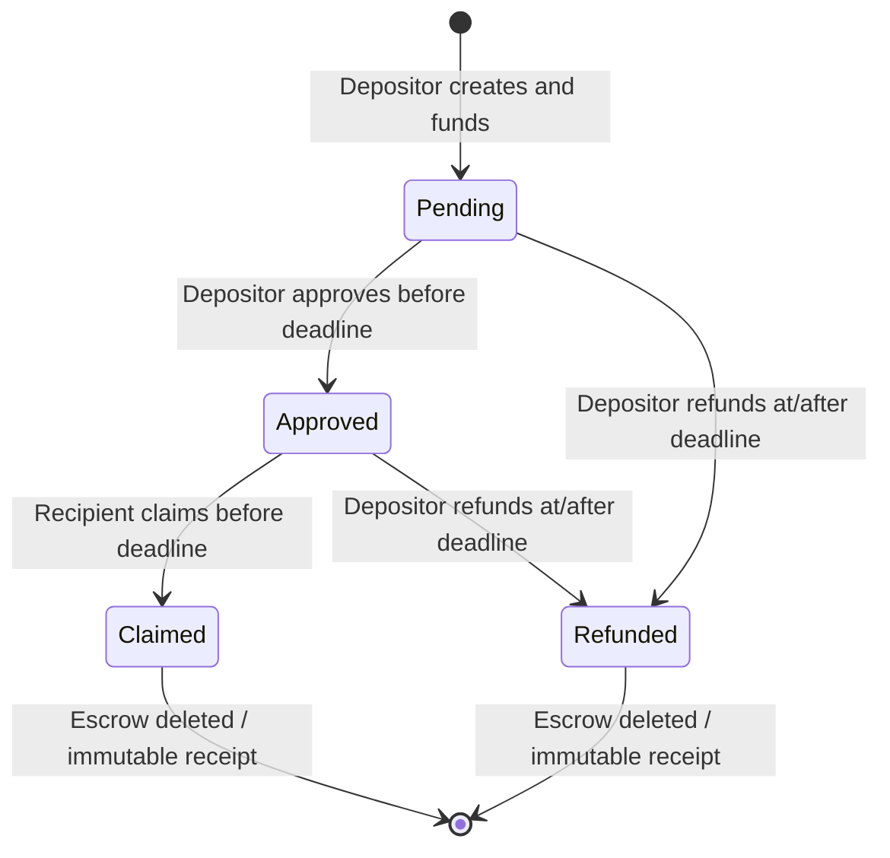

# Approval and deadline escrow

This generic Move escrow holds a real `Balance<T>` in a shared object. The depositor approves release; only the named recipient can claim before the deadline. At or after the deadline, only the depositor can refund. Settlement consumes the escrow and freezes an immutable outcome receipt.

An application that needs conditional custody with explicit recipient, approval, and timeout rules would use this starter. It contains no exchange, yield promise, or product-specific dispute policy. The end-to-end scenario uses **native testnet SUI**, making it independent of the Circle faucet and third-party DeFi credentials.

## Five-minute quickstart

From `sui/`:

```sh
cp .env.example .env
make install
make -C defi demo
make test
```

The shared runner generates or restores private testnet accounts in ignored `.run/`, funds them through the official SUI faucet, compiles and publishes the package, and supplies `ScenarioContext` to [`demo.ts`](demo.ts). The scenario creates two escrows: one approved claim and one expired refund. The refund path waits for the **on-chain Clock**; it does not modify local or public chain time.

Only the shared runner executes network writes. Keep the repository's serial build wrapper and pinned toolchain; do not run another compiler or test suite concurrently. Faucet rate limits may prevent funding, in which case the run must fail clearly rather than fabricate assets.

## State and authority



[`escrow.move`](../move/sources/escrow.move) exports:

| Function | Condition | Result |
| --- | --- | --- |
| `create<T>` | Positive coin, distinct nonzero recipient, future deadline, 1–128 byte reference | Shared `Escrow<T>` with its real balance. |
| `approve<T>` | Depositor, before deadline, not already approved | Irreversible approval flag and event. |
| `claim<T>` | Recipient, approved, strictly before deadline | Full payout to recipient; escrow consumed. |
| `refund<T>` | Depositor, at or after deadline | Full refund to depositor; escrow consumed. |

Approval does not extend the deadline. Once expired, an approved recipient cannot claim; the depositor can refund. A shared object is publicly addressable, but the module's sender and Clock checks enforce these conditions.

`OutcomeReceipt<T>` records the original escrow ID, depositor, recipient, actual payout address, amount, outcome, settlement time, and reference. Outcome **0** means recipient claim; **1** means depositor refund. A receipt is frozen after creation, so it cannot be edited to represent a different settlement.

## What the scenario proves

Each escrow holds **1,000,000 MIST** (0.001 testnet SUI). Deposits split the depositor's gas coin; settlement uses a separate gas sponsor so the payout address receives exactly the escrow amount without a gas deduction. No stablecoin integration is claimed here.

The deposit template declares its gas-coin withdrawal before execution. Coin selection requires the complete gas budget **plus** the deposit because Sui reserves that budget before running PTB commands. Pass the same `Transaction` instance through `ScenarioContext.execute`; cloning or serializing it would discard this local funding declaration.

The successful path verifies the shared object's BCS state, approval event and flag, receipt type and immutable ownership, settlement event, payout balance effects, and escrow deletion. The refund's settlement timestamp must meet its on-chain deadline.

Seven negative simulations retain normal transaction validation and require the expected Move abort **from this exact package's `escrow` module**:

| Rejected action | Abort code |
| --- | --- |
| Non-depositor approval | 5 |
| Recipient claim before approval | 7 |
| Duplicate approval | 10 |
| Non-recipient claim | 6 |
| Early refund | 9 |
| Approved claim after deadline | 8 |
| Non-depositor refund | 5 |

The pinned gRPC SDK also simulates during full transaction construction. Its typed `SimulationError.executionError` can prove a rejection before the explicit simulation call; the runner records that separately as `resolution-simulation-rejection`, with normal SDK checks enabled. A gas error, missing object, bad signature, network failure, or unrelated abort cannot pass a negative assertion. Simulations are recorded separately from executed transaction receipts.

## Last proven

Executed **2026-09-14T00:25:07.554Z** on public Testnet. [Claim transaction](https://suiscan.xyz/testnet/tx/4moZ8Bkt8a44Z1Ej3xg1isj4aLbXq2Wrk3tqpsXYmV23): `4moZ8Bkt8a44Z1Ej3xg1isj4aLbXq2Wrk3tqpsXYmV23`. [Refund transaction](https://suiscan.xyz/testnet/tx/AJXnY4nZKrtE67en3bsbk6dyXXby1SEsmge8du49VAJw): `AJXnY4nZKrtE67en3bsbk6dyXXby1SEsmge8du49VAJw`. Immutable claim receipt `0xa605dbef1a979d7a8d10560b045105a121f0f0ca0ced8ab7aa6f25caa2e5aba2`; refund receipt `0xf8fead13b816a946f934db63a2f9b0a4b980307c8ad745c8253720c5b1c7c39b`. [Full evidence](receipts/testnet-latest.json) records six successful transactions, seven checked rejection simulations, actual Clock deadlines, exact payouts and 19 source hashes. Strict TypeScript +20 Bun +29 Move tests pass.

The core script requires the pinned Testnet genesis digest `69WiPg3DAQiwdxfncX6wYQ2siKwAe6L9BZthQea3JNMD`; it does not silently switch to Devnet or mainnet. Testnet is preferred because the official stablecoin component uses it too, and Devnet resets would erase evidence. The CLI wallet and global keystore remain outside the scenario's inputs.

## Pins and integration notes

`@mysten/sui` **2.31.0**, Node ≥22, ESM; official Sui **testnet-v1.79.0** compiler at `46f18562f1f5af2438d35828e8b62d5e0b972db7`; Move edition **2024** with generated `Move.lock`. The SDK uses gRPC for funding checks, package publication, execution, and reads. Official public fullnodes rejected JSON-RPC during readiness verification.

The generic Move module can hold another legitimate `Coin<T>` without taking a dependency on that token's Move source. Supply the exact published type and real coin objects. A different asset requires its own executed evidence; do not relabel the SUI receipt as a stablecoin proof.

Keep private account state in ignored `.run/` with private file permissions. Retain the same accounts between attempts; all recorded receipt fields and transaction digests are public chain data. Original starter code is MIT licensed; upstream framework and SDK licenses remain in force.

Official references: [shared objects](https://docs.sui.io/develop/objects/object-ownership/shared), [Sui faucet](https://docs.sui.io/getting-started/onboarding/get-coins), [gRPC SDK](https://sdk.mystenlabs.com/sui/clients/grpc), [transaction signing](https://sdk.mystenlabs.com/sui/transactions/signing-and-execution), [Move package management](https://docs.sui.io/develop/manage-packages/move-package-management).

Public prior-art publication and its date remain pending the actual repository push. Disclose the precise starter commit reused and the new work built during the event.
