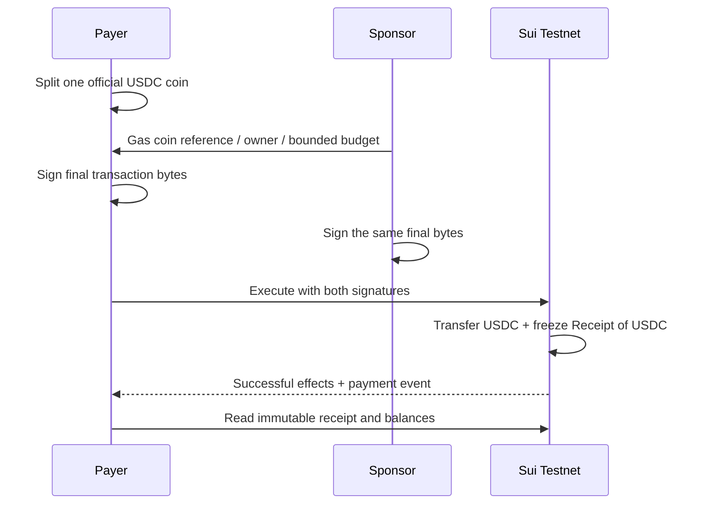

# Sponsored stablecoin payment

**NOT PROVEN until a real Circle testnet USDC transfer produces a verified receipt.** This component transfers one official testnet USDC from a payer to a different recipient. A third address pays gas. The same transaction creates an immutable, typed payment receipt and emits its matching event.

An application that needs a stablecoin payment with gas sponsorship and a receipt object would use this starter. The original Move code is generic over `Coin<T>`; the payment scenario explicitly requires Circle's official USDC type. It does not mint an imitation stablecoin or count native SUI as a stablecoin proof.

## Quickstart

From `sui/`, use the shared setup and sequential runner:

```sh
cp .env.example .env
make install
make -C payments demo
make test
```

The root runner owns package publication, testnet funding, and private account state. The scenario in [`demo.ts`](demo.ts) receives those accounts through the shared `ScenarioContext`; it never reads a global CLI wallet or keystore. Keep ignored `.run/` account state between retries, especially while waiting for faucet funding.

If the payer lacks USDC, the demo exits nonzero and prints that payer's public address. Open the [official Circle faucet](https://faucet.circle.com), select **USDC → Sui Testnet**, and fund that exact address. Re-run with the same account state. The faucet requires no account, allows 20 USDC per two-hour interval, and is protected by reCAPTCHA; a human may need to complete that step. The documented Circle Wallets faucet API does not currently list Sui, so this kit does not invent an API-key workaround.

The sponsor needs faucet SUI for gas; the payer's USDC payment does not need payer-funded gas. All tokens here are testnet assets with no financial value. Missing faucet funding is a documented blocker, never a simulated success.

## Official asset and toolchain

```text
0xa1ec7fc00a6f40db9693ad1415d0c193ad3906494428cf252621037bd7117e29::usdc::USDC
```

The scenario checks this exact [Circle testnet coin type](https://developers.circle.com/stablecoins/usdc-contract-addresses), its six-decimal USDC metadata, the payer's actual owned coin, and the amount **1,000,000 atomic units**. No Circle Devnet USDC deployment is claimed.

- TypeScript SDK: `@mysten/sui` **2.31.0**, ESM, Node ≥22.
- Compiler baseline: official Sui **testnet-v1.79.0**, source tag commit `46f18562f1f5af2438d35828e8b62d5e0b972db7`.
- Move edition: **2024**, automatically resolved system dependencies pinned by the generated `Move.lock` and compiler record.
- Transport: `SuiGrpcClient`, public testnet `https://fullnode.testnet.sui.io:443`. The server's genesis digest must equal `69WiPg3DAQiwdxfncX6wYQ2siKwAe6L9BZthQea3JNMD`.

The official public fullnodes rejected JSON-RPC during readiness checks. Use the supplied gRPC client for balances, coins, publication, execution, and object reads. A new SDK success response has `$kind: 'Transaction'`; a digest from `FailedTransaction` is not success.

## Transaction boundary



[`payments::pay<T>`](../move/sources/payments.move) transfers the supplied coin's entire amount to the specified nonzero, distinct recipient. A programmable transaction first splits the exact payment amount from the payer's coin. The module freezes `Receipt<T> { id, payer, recipient, amount, reference }` and emits `Payment<T>` with the receipt ID. The reference is bounded to 1–128 bytes.

[`lib/client.ts`](../lib/client.ts) sets an explicit gas owner, owned gas coin reference, reference gas price, and bounded budget before either signer signs. It executes the two signatures against the same bytes, waits for the transaction, and checks the executed sender and sponsor. This is a local template runner, not an unrestricted public sponsorship service.

The proof requires all of the following: successful transaction effects, exactly one created `Receipt<USDC>`, immutable ownership, the correct creating transaction, BCS-decoded receipt and event fields, exact payer/recipient USDC deltas, unchanged payer SUI, two signatures, and sponsor SUI effects matching its observed balance change. No unsigned payload or dry run can satisfy these checks.

## Last proven

**PENDING execution and shared tests.** No successful stablecoin payment digest is recorded yet. If Circle faucet funding is unavailable, keep this component **NOT PROVEN** and proceed with the native-SUI escrow component. Once execution succeeds, record the runner's receipt path, transaction digest, receipt object ID, timestamp, and testnet source here.

Private keys belong only in ignored `.run/` files with private filesystem permissions or a developer-supplied private environment. Never publish keys, faucet authentication tokens, or raw account-state files. Public receipts contain only chain evidence and nonsecret configuration. Do not put a sender's secret key in a frontend bundle.

Official references: [Sui faucet](https://docs.sui.io/getting-started/onboarding/get-coins), [gRPC SDK](https://sdk.mystenlabs.com/sui/clients/grpc), [signing and sponsorship](https://sdk.mystenlabs.com/sui/transactions/signing-and-execution), [Circle USDC addresses](https://developers.circle.com/stablecoins/usdc-contract-addresses), [package management](https://docs.sui.io/develop/manage-packages/move-package-management).

Original starter code is MIT licensed. Public prior-art publication and its date remain pending the actual repository push; disclose the precise reused commit and new event work.
