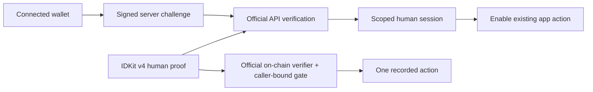

# World continuity recipe

**NOT PROVEN — an authentic, fresh World ID v4 proof and Developer Portal configuration are required.** `make demo` fails nonzero without them. The implementation can be integrated in about one hour once the Portal setup and eligible human account already exist; creating those prerequisites is outside that estimate.

Use this recipe when an existing app needs a wallet-bound human gate around a single action. The starter records a generic action counter so the proof boundary is visible. Bring product-specific authorization and action logic after the integration is proven. World Tokyo's final prize categories remain TBD; this folder is component coverage, not a claim of a confirmed Continuity prize.

## One-hour integration

| Time | Work | Observable result |
| --- | --- | --- |
| 0–10 min | Copy the pinned World dependencies and environment template; configure the Mini App and World ID Portal apps, action, RP, and exact origin. | The UI displays the correct environment and enables configured actions. |
| 10–25 min | Mount the MiniKit provider and IDKit widget; connect a wallet and sign a server-issued challenge. | A wallet-bound v4 request with explicit raw-byte signal and expiry constraints. |
| 25–40 min | Add the server challenge/verification service and transactional replay store. | Official proof verification and one consumed action nullifier; a replay fails. |
| 40–50 min | Export the authentic proof privately and run the gate demo on an isolated World Chain fork. | The official verifier accepts one caller-bound action and rejects replay. |
| 50–60 min | Add the recorded receipt to your integration notes and disclose this starter's public commit. | A reproducible integration boundary and clear prior-art attribution. |

The Next.js implementation is in [`app/`](../app). The strict World ID service is in [`world-id-verify/server/`](../world-id-verify/server); the on-chain boundary is [`WorldIDGate.sol`](../src/WorldIDGate.sol). Keep the service and its replay store together when adapting it. A wallet signature alone must not set a human-verified session.

## Quickstart and demo

From `world/`:

```sh
cp .env.example .env
make install
make dev
```

Follow [MiniKit Portal setup](../minikit-app/README.md) and [World ID verification](../world-id-verify/README.md). In the UI, connect a wallet, complete **Verify with World ID**, then choose **Download private proof**. Store that private export as `.run/world-id-private-proof.json`; this ignored directory keeps it out of git. Confirm that `WORLD_RP_ID`, `WORLD_ID_ACTION`, and `WORLD_ID_ENVIRONMENT` match the proof. Run promptly before the signed request expires:

```sh
make -C continuity-recipe demo
make test
```

The demo deploys a gate on an isolated fork of World Chain **480**, uses the configured official v4 staging or production verifier, submits the real proof from its bound wallet, checks the action counter, and rejects a second use. Wallet impersonation and synthetic gas occur only on the local fork; the official verifier and its underlying state are unchanged. The CLI writes a receipt to `world/receipts/` containing the transaction, deployment, verifier, configuration, and private proof file hash, without publishing the proof itself.

The exported proof has this shape; its `result` must be the authentic IDKit output:

```ts
{ wallet, rpId, action, result }
```

Off-chain API verification and on-chain verification have separate replay stores. A valid proof accepted by the API can still be used once by this newly deployed gate during its expiry window. The CLI's on-chain receipt explicitly records `apiVerificationIncluded: false`; it does not independently prove the browser or API steps.

## Last proven

**NOT PROVEN — no authentic human proof or successful official-verifier action receipt is available yet.** Local fixture tests and official-verifier rejection tests are useful checks, but they cannot establish a successful human verification. `make -C .. probe` from this folder records infrastructure evidence only and does not complete this recipe.

For a full MiniKit continuity integration, also finish the live [MiniKit receipt](../minikit-app/README.md#last-proven): a submitted user operation is not a confirmed transaction. The zero-value `WorldPing` contract is a transport example; it does not enforce identity. Use `WorldIDGate` for contract-enforced proof checks.

## Integration boundaries



Use Node 24+ for the Next.js SQLite server. Keep RP signing keys, agent keys, proof JSON, and databases private. Preserve exact origin checks, wallet binding, RP/action/environment validation, expiry constraints, and atomic nullifier consumption. Staging and production v4 verifier addresses belong to World Chain 480; the legacy Sepolia interface is not a substitute. Portal screenshots remain pending an authenticated Portal session.

Official sources: [IDKit in Mini Apps](https://docs.world.org/world-id/idkit/mini-apps), [World Developer Portal](https://developer.world.org), and the exact deployment and package sources in [`../SOURCES.md`](../SOURCES.md). Original code is MIT licensed. Public prior-art publication remains pending the repository push and recorded timestamp; see [`../PRIOR-ART.md`](../PRIOR-ART.md).
